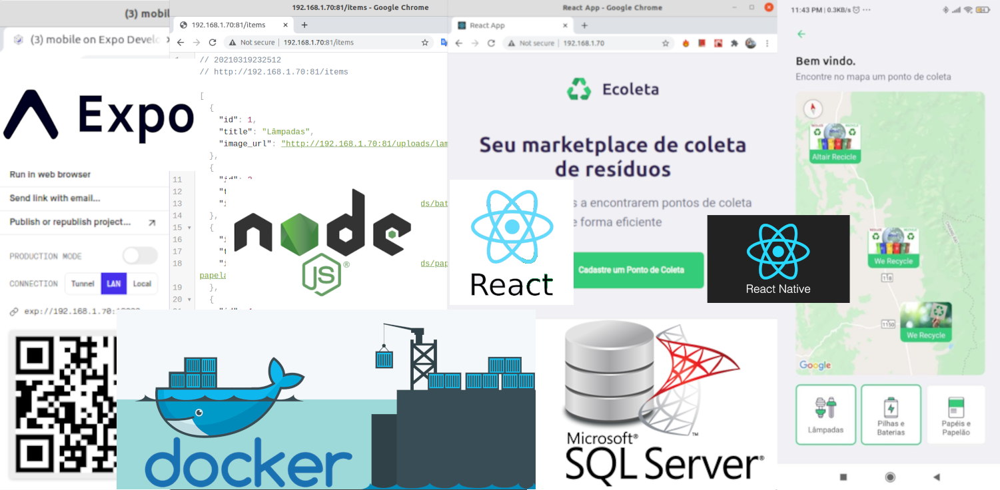

# NLW1 - Ecoleta na Tailândia - Com Docker e SQL Server Container

Read this in other languages: [English](README.en.md), [Portuguese](README.md).

Esse projeto foi baseado no Projeto `Ecoleta` da :rocket:[Rocketseact](https://github.com/rocketseat-education/nlw-01-omnistack) :wave:, projeto **Show**. Muito felizmente bate com o projeto da minha monografia, que trata sobre como usar tecnologia, como Apps, IoT, Big Data para melhorar o processo de reciclágem no Brasil.

Projeto Desenvolvido com as seguintes tecnologias, feito do zero, tendo algumas diferenças do projeto inicial:

O Primeiro passo desse projeto está no Github https://github.com/lexvieira/Docker-Init-Nodejs-React-React-Native-SQLServer que foi iniciar o projeto do zero e adicionar as primeiras funcionalidades. Nesse aqui vamos explorar mas a parte de código, mas vamos utilizar o Docker para subir os serviços Backend com Node, Database SQL Server, Front End com React e Mobile com React Native.

* [Docker](https://www.docker.com/) - Crie containers e rode projetos sem precisar criar todo o ambiente na sua máquina. 
* [Docker-compose](https://docs.docker.com/compose) - Suba todo o ambiente com somente comando `docker-compose up`. 
* [Node.js](https://nodejs.org/en/) - Backend da nossa aplicação, responsável pela parte de negócios. Veja: https://www.pluralsight.com/blog/software-development/front-end-vs-back-end
* [React](https://reactjs.org) - Frontend, responsável pela interação com o usuário. 
* [React Native](https://facebook.github.io/react-native/) - Mobile app desenvolvido para multiplataforma, Android e IOS. 
* [Expo](https://expo.io/) - Responsável por compilar (converter) o projeto móvel com código Javascript / Typescript e implantá-lo em telefones Android e IOS.
* [SQL Server](https://hub.docker.com/_/microsoft-mssql-server/) - Banco de dados relacional de grande porte da Microsoft.
* [KNEX Query Builder for Node.js](http://knexjs.org/) - Técnica que é usada para construir consultas. Ele suporta vários bancos de dados como MSSQL, Postgres, MySQL, SQLite, Oracle e alguns outros também.
* [NPM (Gerenciador de Pacotes)](https://www.npmjs.com/) - Gerenciador de pacotes integrado com o Node que nos permite instalar os pacotes(bibliotecas) necessários em nossas 3 aplicações.

  

Projeto para melhorar o processo de Reciclágem no país usando tecnologia, como apps, IoT, Big Data e Data Science. 

## 🤔 Como contribuir

- Faça um fork desse repositório;
- Cria uma branch com a sua feature: `git checkout -b minha-feature`;
- Faça commit das suas alterações: `git commit -m 'feat: Minha nova feature'`;
- Faça push para a sua branch: `git push origin minha-feature`.

Depois que o merge da sua pull request for feito, você pode deletar a sua branch.

## :memo: Licença

Esse projeto está sob a licença MIT. Veja o arquivo [LICENSE](LICENSE.md) para mais detalhes.

---

## Ecoleta usando NodeJS (Backend), React (Web) and React Native (Mobile) e Banco de Dados rodando com Docker e Docker Compose. 

Se quiser ver como subir um projeto do zero usando o Docker, veja o Github https://github.com/lexvieira/Docker-Init-Nodejs-React-React-Native-SQLServer.

Nesse vamos começar pelo `NPM Install`, caso você dê um clone do projeto no Github ou faça o download do mesmo. 

`await.....`  

---

# CREDITOS

Como normalmente, as vezes temos alguns problemas para configurar um ambiente, e com Docker não foi diferente, então aqui vai os creditos para os camaradas que ajudaram um pouco com esse pequeno projeto com **Docker**, **Node.js**, **React** e **React Native**. 

### Rocketseat

- [rocketseat-education-semana-omnistack-10](https://github.com/rocketseat-education/semana-omnistack-10)

- [rocketseat-education/nlw-01-omnistack](https://github.com/rocketseat-education/nlw-01-omnistack)

### Docker

- [Running Expo/React Native in Docker - Haseeb Majid - Nov 1, 2018](https://hmajid2301.medium.com/running-expo-react-native-in-docker-ff9c4f2a4388)

- [Running React Native in Docker — Part 1/2 - Pavan Welihinda - Dec 9, 2019](https://medium.com/@pavan168/pavanwelihinda-running-react-native-in-docker-a0fe0b0c776e)

- [How to Run React Native Expo Web in a Docker Container - rockyourcode - 2020-10-20](https://www.rockyourcode.com/how-to-run-react-native-expo-web-in-a-docker-container/)

- [Metro bundler with Expo dockerized app is not working](https://stackoverflow.com/questions/59638451/metro-bundler-with-expo-dockerized-app-is-not-working)

- [Securing WebSocket API prevents use of Expo DevTools](https://github.com/expo/expo-cli/issues/1081)

- [MDBootstrap Angular Project with Dockers](https://github.com/lexvieira/mdbootstrapangular)

### Alias

- [Linux and Unix alias command tutorial with examples](https://shapeshed.com/unix-alias/)
- [How to set and save an alias in Windows Command Line using doskey](https://www.youtube.com/watch?v=E_6Lklnakew)
- [Your Must-Have PowerShell Aliases for Docker](https://blog.sixeyed.com/your-must-have-powershell-aliases-for-docker/)

### Readme Format and Other Stuff ;)

- [GitHub Cheat Sheet](https://github.com/tiimgreen/github-cheat-sheet/blob/master/README.md)
- [Get started with Docker Compose](https://docs.docker.com/compose/gettingstarted/)
- [Dockerfile reference](https://docs.docker.com/engine/reference/builder/)
- [Basic writing and formatting syntax](https://docs.github.com/en/github/writing-on-github/basic-writing-and-formatting-syntax#headings)

# Comments

Nova feature que permite rodar o projeto inteiro usando Docker ou Docker-compose, sem a necessidade de instalar qualquer framework no computador. 

Adequado para pessoas que estão aprendendo a trabalhar com Docker ou que estão aprendendo a trabalhar com muitas tecnologias e não pretendem instalar vários ambientes como NodeJS, MongoDB, Ruby, PHP, Webservers e outros. Também é útil para usuários que tenham um PC ou Laptop com poucos recursos, como memória, processador e disco. Embora seja necessário estar atendo a quantidade de imagens que são baixadas para não comprometer o espaço do sistema operacional.
